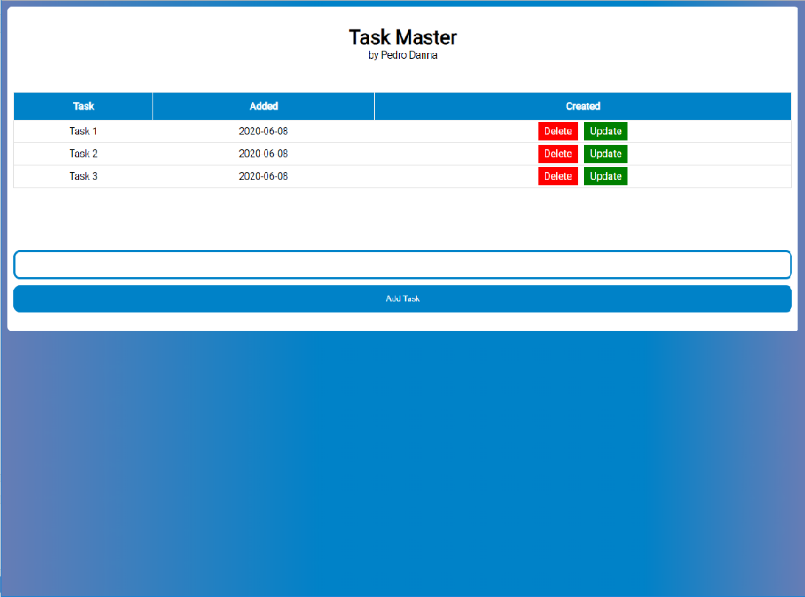

# Task Master Python Flask

> Sample project to learn skills in python Flask.

Additional description about the project and its features.

## Built With

- Python
- Flask
- SQLite

## Live Demo

[Demo](https://task-master-pedrodanna.herokuapp.com/)

## Getting Started

**You need to install Python 3 and pip to run this app.**
**After python and pip installation you should install all the libraries from requirements.**
**Then you should run the app.py script**

To get a local copy up and running follow these simple example steps.

### Prerequisites
[Requirements](https://github.com/pedrodanna/task-master/blob/master/requirements.txt)

### Setup
-Execute app.py

## Author

👤 **Pedro Danna**

- Github: [@pedrodanna](https://github.com/pedrodanna)
- Twitter: [@_pedrodanna](https://twitter.com/_pedrodanna)
- Linkedin: [Pedro Danna](https://www.linkedin.com/in/pedro-danna-730690189/)

## 🤝 Contributing

Contributions, issues and feature requests are welcome!

Feel free to check the [issues page](https://github.com/pedrodanna/task-master/issues).

## Show your support

Give a ⭐️ if you like this project!

## Acknowledgments

-Project build with the help of freeCodeCamp

## 📝 License

This project is [MIT](https://github.com/pedrodanna/task-master/blob/master/LICENSE) licensed.
